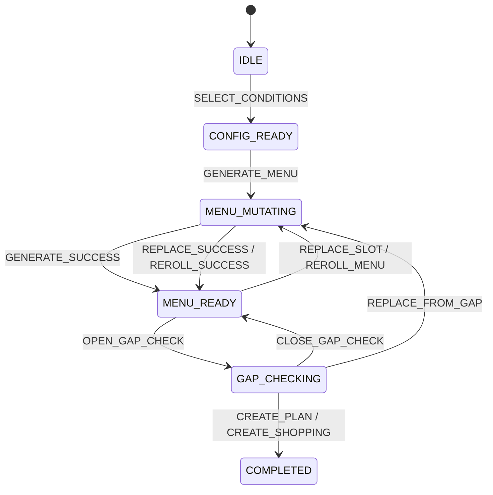
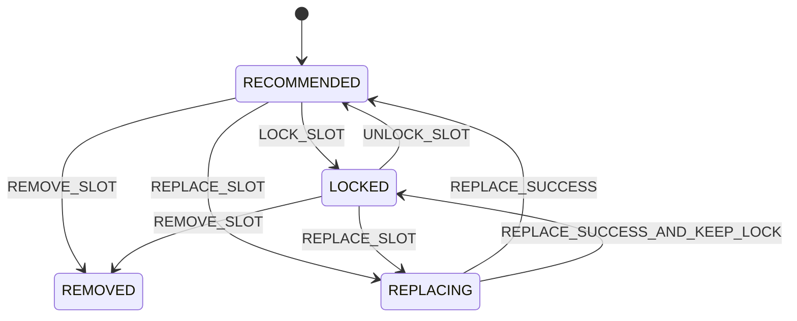

# 随机页前端状态机与组件拆分稿

## 一、文档定位

本文只定义前端页面的最小状态机和组件拆分。

目标不是先写组件树，而是把这些问题定死：

- 页面有哪些稳定状态
- 每个状态允许什么动作
- 哪些状态由整页维护，哪些状态由单个菜位维护
- 组件边界如何划分，避免一开始就做成巨型页面文件或通用引擎

## 二、页面目标

随机页的最小闭环是：

`选条件 -> 生成一桌 -> 逐道保留/划掉/换菜 -> 本桌缺口预检 -> 处理缺口 -> 加入计划或去采购`

这里的核心不是“展示三套候选”，而是“围绕一桌菜做局部决策”。

## 三、页面级状态机

页面级状态建议固定为 6 个：

1. `IDLE`
2. `CONFIG_READY`
3. `MENU_READY`
4. `MENU_MUTATING`
5. `GAP_CHECKING`
6. `COMPLETED`

### 3.1 状态定义

`IDLE`

- 首次进入页面，还没有完成一次有效生成。
- 只显示条件区和空结果占位。

`CONFIG_READY`

- 用户已选定餐次 / 人数 / 冰箱优先。
- 允许点击“生成一桌”。

`MENU_READY`

- 已拿到当前菜单结果。
- 允许保留、划掉、换一道、整桌重摇、进入缺口预检。

`MENU_MUTATING`

- 页面存在至少一个进行中的菜位替换请求，或一次整桌重摇请求。
- 整页不需要完全禁用，但要阻止重复触发同类请求。

`GAP_CHECKING`

- 正在做本桌缺口预检，或已进入缺口面板并处理中间决策。
- 允许在缺口面板中继续确认库存、划掉菜、换菜、选择采购。

`COMPLETED`

- 用户已完成本轮出口动作：
  已加入计划，或已确认这桌并写入购物清单。

### 3.2 页面状态流转



### 3.3 页面级守卫规则

- 没有 `mealSlot` 时不能生成菜单。
- 没有 `peopleCount` 时不能生成菜单。
- 存在未完成的整桌生成请求时，禁用“再随机一桌”。
- 存在未处理的 `unknown` 菜位时，禁用“加入计划”。
- 存在 `missing` 菜位且用户未明确处理时，禁用“加入计划”。

## 四、菜位级状态机

菜位状态单独维护，不能混进页面级布尔堆里。

菜位状态固定为 4 个：

1. `RECOMMENDED`
2. `LOCKED`
3. `REMOVED`
4. `REPLACING`

### 4.1 状态定义

`RECOMMENDED`

- 该菜位当前有推荐结果，但用户未锁定。

`LOCKED`

- 用户明确保留这道菜。
- 后续整桌重摇也不应覆盖，除非用户主动取消锁定。

`REMOVED`

- 用户划掉该菜位。
- 页面显示当前位置为空，但不自动补位。

`REPLACING`

- 当前菜位正在发起“换一道”请求。
- 只禁用当前菜位操作，不阻塞其他菜位。

### 4.2 菜位状态流转



### 4.3 菜位局部规则

- `REPLACING` 状态下，当前菜位的“换一道”按钮禁用。
- 其他菜位在同一时间仍可继续替换。
- 每个菜位单独维护 `requestSeq`，只接受最后一次替换响应。
- 每个菜位单独维护 `replaceConstraints`，切换菜位时互不污染。

## 五、缺口预检状态

缺口预检不是另一个页面状态树，而是挂在当前菜单上的一层局部决策状态。

每个已保留菜位在缺口预检中额外维护：

```ts
type GapStatus = "OK" | "PARTIAL" | "MISSING" | "UNKNOWN";

type GapDecision = {
  status: GapStatus;
  inventoryDecisions: Array<{
    decisionKey: string;
    decision: "HAS" | "MISSING";
  }>;
  action: "KEEP" | "REMOVE" | "REPLACE" | "BUY" | "KEEP_PENDING" | null;
};
```

说明：

- `KEEP_PENDING` 对应“保留但暂不采购”。
- `UNKNOWN` 不允许静默透传到计划创建。
- `REMOVE` 和 `REPLACE` 应直接回写到菜单结果区。

## 六、推荐的数据组织方式

随机页不建议上 Pinia。

推荐以页面局部状态组织：

```ts
type RandomPageState = {
  pageStatus: "IDLE" | "CONFIG_READY" | "MENU_READY" | "MENU_MUTATING" | "GAP_CHECKING" | "COMPLETED";
  conditions: {
    mealSlot: "BREAKFAST" | "LUNCH" | "DINNER" | null;
    peopleCount: number | null;
    fridgePreferred: boolean;
  };
  slotPlan: RandomSlotPlan | null;
  slots: RandomSlotViewModel[];
  gap: {
    visible: boolean;
    items: RandomGapViewModel[];
    summary: RandomGapSummary | null;
  };
};
```

原因：

- 这是强页面流程状态，不是跨页共享状态。
- 放 Pinia 只会增加退出后残留状态、跨入口污染和恢复逻辑复杂度。

## 七、组件拆分

组件先按页面局部职责拆，不做通用决策引擎。

### 7.1 页面骨架

`pages_meal/random/index.vue`

负责：

- 页面级状态编排
- 首屏条件和菜单结果联动
- 调 API
- 控制缺口面板显隐
- 处理加入计划 / 去采购出口

不负责：

- 菜位卡内部细节
- 单个约束 chips 的展示逻辑
- 缺口项的行级渲染

### 7.2 组件建议

`RandomConditionBar.vue`

- 餐次选择
- 人数选择
- 冰箱优先勾选
- 生成一桌 / 全部重摇

`RandomMenuBoard.vue`

- 当前菜单总览
- 菜位列表编排
- 已保留数量、已划掉数量、待补数量摘要

`RandomSlotCard.vue`

- 单个菜位展示
- 保留 / 划掉 / 换一道
- 当前菜位的替换约束 chips
- 局部加载态

`RandomGapPanel.vue`

- 本桌缺口预检结果
- `ok / partial / missing / unknown` 分组展示
- 缺口动作：确认有、确认无、划掉、换菜、加入购物清单、保留待处理

`RandomBottomBar.vue`

- 主出口按钮
- 根据状态切换：
  生成前显示“生成一桌”
  有菜单后显示“看看缺什么”
  缺口面板通过后显示“加入计划” / “去采购缺口”

### 7.3 可选的局部子组件

如果 `RandomSlotCard.vue` 代码量继续增大，再局部拆：

- `RandomReplaceChips.vue`
- `RandomGapIngredientRow.vue`

首版不提前抽出更多层。

## 八、关键事件与触发条件

页面最少需要这些事件：

- `SELECT_MEAL_SLOT`
- `SELECT_PEOPLE_COUNT`
- `TOGGLE_FRIDGE_PREFERRED`
- `GENERATE_MENU`
- `REROLL_MENU`
- `LOCK_SLOT`
- `UNLOCK_SLOT`
- `REMOVE_SLOT`
- `REPLACE_SLOT`
- `OPEN_GAP_CHECK`
- `CONFIRM_UNKNOWN_HAS`
- `CONFIRM_UNKNOWN_MISSING`
- `BUY_GAP_ITEMS`
- `KEEP_PENDING`
- `CREATE_PLAN`
- `CREATE_SHOPPING`

### 8.1 事件守卫

`GENERATE_MENU`

- 需要 `mealSlot` 和 `peopleCount`

`REPLACE_SLOT`

- 当前菜位不能是 `REPLACING`
- 当前菜位不能是空槽位

`OPEN_GAP_CHECK`

- 当前至少有 1 个未划掉菜位

`CREATE_PLAN`

- `unknownCount === 0`
- 所有 `missing` 菜位都已被 `REMOVE / REPLACE / BUY / KEEP_PENDING`

## 九、并发与响应覆盖规则

### 9.1 菜位替换

每个菜位维护：

```ts
{
  requestSeq: number;
  latestAppliedSeq: number;
}
```

规则：

- 点击“换一道”时 `requestSeq + 1`
- 请求返回时，只有 `response.requestSeq === current.requestSeq` 才允许覆盖

### 9.2 缺口预检

缺口预检建议整页串行：

- 同一时间只保留一个 `check-gap` 请求
- 新请求发出后，旧请求结果直接丢弃

### 9.3 计划创建 / 购物清单写入

- 这两个写操作必须单独 loading
- 使用 `operationId`
- 成功后立刻锁住重复提交按钮，直到跳转完成

## 十、页面展示建议

随机页首屏建议固定 4 个视觉区：

1. 条件栏
2. 菜单结果区
3. 缺口结果区或缺口面板入口
4. 底部确认栏

页面信息顺序固定为：

- 先选条件
- 再看一桌结果
- 再做缺口处理
- 最后决定计划或采购

不要回到“3 套候选并排比较”的旧原型。

## 十一、实现结论

前端首版建议坚持 4 条：

1. 页面状态只放页面本地，不上 Pinia
2. 菜位状态独立维护，不做整页布尔混合
3. 缺口预检作为当前菜单的附加决策层，不另造全局缺口状态
4. 组件拆分先服务当前页面，不提前抽通用随机引擎

这样改造 `pages_meal/random/index.vue` 时，既能从当前“3 套候选原型”平滑迁移，也不会把首版复杂度抬到不可控。

## 十二、实现拆分与过渡约束

这一页的实现最容易失控在两件事上：

1. 为了过渡，把旧原型和新流程糊在一起
2. 为了“可复用”，过早抽出通用引擎

这里直接冻结。

### 12.1 文件拆分建议

首版建议只新增这些局部 owner：

- `pages_meal/apis/random.ts`
- `pages_meal/components/RandomConditionBar.vue`
- `pages_meal/components/RandomMenuBoard.vue`
- `pages_meal/components/RandomSlotCard.vue`
- `pages_meal/components/RandomGapPanel.vue`
- `pages_meal/components/RandomBottomBar.vue`

如需局部类型文件，可加：

- `pages_meal/types/random.ts`

不要一开始就新增：

- `stores/random.ts`
- `composables/useRandomEngine.ts`
- `utils/random-manager.ts`
- `utils/menu-decision-center.ts`
- `adapters/random-plan-adapter.ts`

这些名字本身就在提示“抽象超过当前证据”。

### 12.2 过渡改造策略

随机页现在是“3 套候选原型”。

迁移时建议按这个顺序改：

1. 先替换数据模型：
   从 `resultItems[]` 的套餐原型，切到 `slots[]` 的单桌结构
2. 再替换交互：
   从“锁定一道候选”切到“每个菜位独立保留 / 划掉 / 换一道”
3. 再接缺口预检
4. 最后接计划与购物清单出口

不要在一个页面里长期并存两套状态：

- `candidateMenus`
- `randomMenu`
- `lockedMealId`
- `slotStates`

这种双模型并存只会把后续每个按钮判断都拖脏。

### 12.3 性能与渲染

首版前端性能约束建议固定：

- 单菜位替换只更新目标菜位，不重建整桌数组引用之外的无关状态
- 缺口预检结果独立存放，不把每个缺口字段都回写到菜单展示模型里
- 菜位卡不监听全页所有 loading，局部 loading 只跟当前菜位关联
- 不为了“状态统一”把整页所有动作都塞进一个巨型 reducer 或 switch

### 12.4 复用边界

可直接复用：

- `pages_meal/apis/meal.ts`
- `pages_pantry/apis/shopping.ts` 的已有结果类型
- 现有 `Layout`
- 现有 `useSystemInfo`

谨慎复用：

- `useCustomRefresher`

只有当随机页最终也采用页面内独立 `scroll-view + 自定义下拉刷新` 时才接；如果只是普通按钮驱动，不要为了“统一”硬接刷新状态机。

不复用：

- `pages_pantry/gap` 的全局缺口展示组件

原因很明确：随机页缺口是“本桌决策面板”，不是“待处理饭局总览”。
